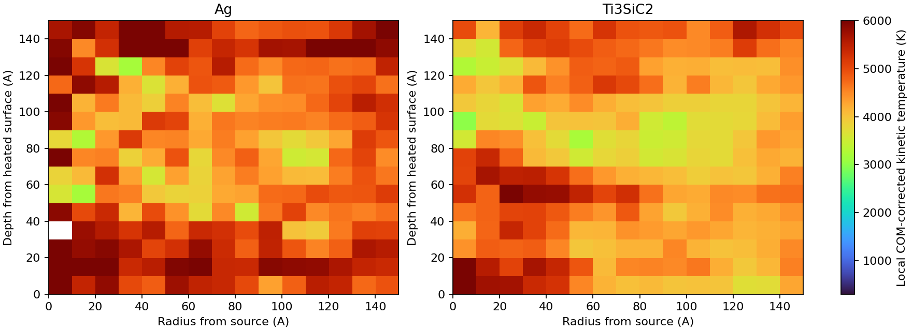

# 候选02：1.3 ps 加热检查图片

图片对应第13000步（1.3 ps），两相温度均扣除了各统计区的质心运动。横轴为距热源中心的半径，纵轴为距加热表面的深度，单位Å；颜色为局部动能温度。

这是温度检查图，不是已形成熔坑的三维结构图。检查发现未验证的交叉势发生巨大能量释放，导致广泛升温；当前分支已经暂停，不能作为已验证的TTM熔坑预测。

[详细检查报告](hot_state_audit.md)
