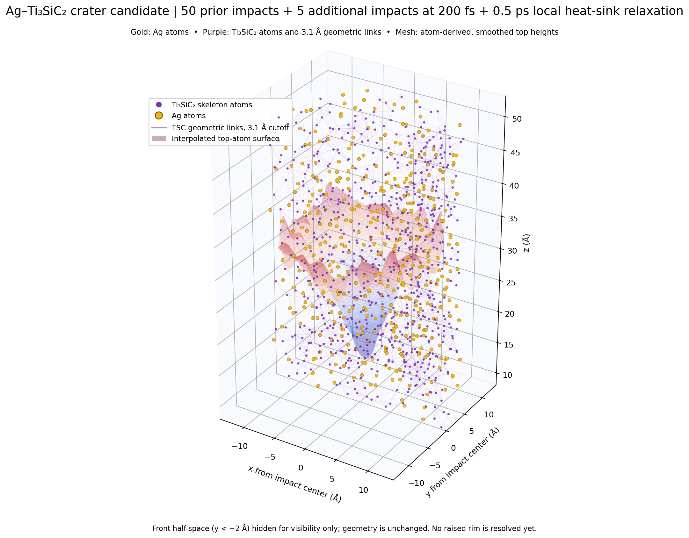

# Ag–Ti₃SiC₂ 双连续阴极：55 发高通量轰击候选

## 本轮状态

这是基于先前 36 发小模型状态继续的探索性分支，完成到累计第 55 发 Ag 入射，并在第 40、45、50、55 发后各做 0.5 ps 局部热沉段。第 37–55 发每发 62 eV、200 fs 发射间隔；发射点在撞击中心半径 7.5 Å 内按近似 `r/(1+(r/6 Å)^2)` 的径向分布随机抽样。详细位置、LAMMPS 输入、每段日志、restart、结构和 dump 均保存在本目录。本轮使用 LAMMPS 30Sep2026 官方 x86_64 静态二进制（SHA-256 `599d046dde36bcf7666dacd45a0a6feb2265743058dea5c1e0d5970a57805784`）；第 37–55 发新增轰击共 3.8 ps，四段热沉共 2.0 ps。

此图是实际原子模型的三维切开展示：金色 Ag、紫色 Ti₃SiC₂ 与按 3.1 Å 邻距绘出的几何连线；半透明网格由原子顶面高度插值得到。图中前半空间为显示内部结构而隐藏，模型坐标没有被裁改。

## 结果摘要

| 指标 | 第 55 发后、热沉 0.5 ps 末 |
|---|---:|
| 原子数 | 4,360（Ti 1,464；Si 519；C 925；Ag 1,452） |
| Ag 质量分数 | 62.06 wt%（质量分数，不是体积分数） |
| 模拟盒 | 面内矢量 (37.286, 0) 与 (−18.643, 32.291) Å（均长 37.286 Å、夹角 120°）；z 范围 −10–100 Å |
| 固体/真空 | 基体原子约 z=0–50.64 Å；上方预留至 z=100 Å |
| 周期边界 | 面内周期，z 非周期（`p p f`） |
| 中心凹陷 | r≤2 Å 与 r=8–12 Å 环带中位高度差约 13.29 Å |
| 可见坑沿 | r=8–12 Å 环带仅比 r=12–18 Å 高约 0.54 Å；尚无清晰隆起坑沿 |
| r<8 Å 局部动能温度 | 基体 Ag 约 3,569 K（117 原子）；Ti₃SiC₂ 约 2,995 K（273 原子） |
| 末段 0.5 ps 位移 RMS | 基体 Ag 1.75 Å；Ti₃SiC₂ 1.38 Å |
| 几何连通性 | Ti₃SiC₂ 2,908/2,908；Ag 最大簇 1,450/1,452 |
| 最短异相接触 | Ag–TSC 1.826 Å；无 Ag–TSC 对短于 1.5 Å |
| 需留意的短键 | C–C 最短约 1.279 Å，需结合势函数验证 |
| 最大力 | 45.44 eV/Å |

中心凹陷呈碗状；这一轮相对第 50 发的中心凹陷深度增加约 0.44 Å，远小于可据此确认持续加深的程度。环带略高于外侧中位面，但约 0.54 Å 的高差不足以称作论文中的明显隆起坑沿。

| 结束状态 | r≤2 Å 中位 z (Å) | r=8–12 Å 中位 z (Å) | 凹陷深度 (Å) |
|---|---:|---:|---:|
| 40 发 + 热沉 | 11.708 | 26.405 | 14.697 |
| 45 发 + 热沉 | 11.688 | 26.449 | 14.761 |
| 50 发 + 热沉 | 13.504 | 26.357 | 12.853 |
| 55 发 + 热沉 | 13.355 | 26.646 | 13.291 |冷却末端有一个 Ag 原子离开基体约 6.7 Å（位于外侧真空，仍在模拟盒中）；所有原子仍计入系统，没有 LAMMPS 丢原子。

每段 LAMMPS 日志的原子数连续增加且没有 `ERROR`/`Lost atoms`。几何审计用 Ti₃SiC₂ 3.1 Å、Ag 3.35 Å 邻距定义连通；它只说明几何连通，不等同于晶相或化学键判定。最近的 C–C 距离约 1.279 Å 是警报项，不能据此把结构视为已验证。

## 解释限制

- 本图显示**碗状凹陷候选**，没有解析出清楚的外侧隆起坑沿。
- 局部动能温度和 0.5 ps 位移说明材料强烈受热且 Ag 有迁移；它们单独不能证明形成液态 Ag 熔池，也不能证明 Ti₃SiC₂ 骨架仍保持晶体序。
- Ag–Ti、Ag–Si、Ag–C 使用项目 Stage69 的 Morse/ZBL 交叉项，尚未用第一性原理或实验数据验证；最大残余力仍偏高。`audit/ag_q6_order.txt` 的 Q₆ 结果也明确无可靠判相能力，因为邻居配位太稀疏。最短 C–C 在前置第 36 发状态已约 1.346 Å，本轮末约 1.279 Å；这是持续存在的力场/几何警报，不能仅归因于最后五发。
- 附件论文使用 Cu 体系并模拟了远长于本试验的演化；这里仅借用 62 eV 与 200 fs 通量条件并换成 Ag，材料、界面结构、势函数、尺度和时长均不同。第 37–55 发共计 3.8 ps 入射演化，四个 0.5 ps 热沉段共 2.0 ps；不是数百 ps 的论文复现。
- 因短 C–C 距离、有限局部样本和未经验证的交叉势，本分支不支持“已形成真实熔池”或“模型已验证”的结论。

## 可复核文件

- `images/crater_after55_highflux_3d.png`：三维原子模型与碗状凹陷预览。
- `structures/cooled_after55_0p5ps.data`：最终 55 发结构。
- `restart/cooled_after55_0p5ps.restart`：最终 restart。
- `dumps/cool_after_55_0p5ps.dump`：末段 0.5 ps 轨迹。
- `audit/audit_cool_after55.txt`、`.json`：局部温度、位移、表面高度、最近距离和连通性摘要。
- `audit/audit_hit_51.txt` 至 `audit/audit_hit_55.txt`：新增各发的阶段检查。
- `inputs/impact_51_62eV.lmp` 至 `impact_55_62eV.lmp` 与 `inputs/cool_after55_0p5ps.lmp`：可复现输入。
- `logs/`、`restart/`、`structures/`、`dumps/`：全阶段记录。
- `SHA256SUMS.txt`：本目录文件校验清单。
