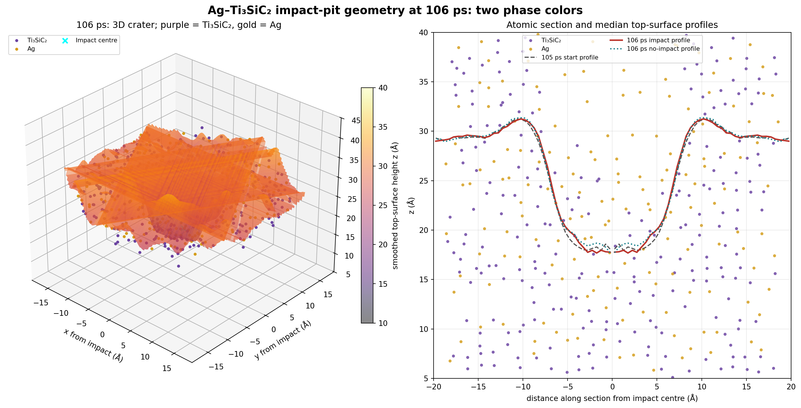
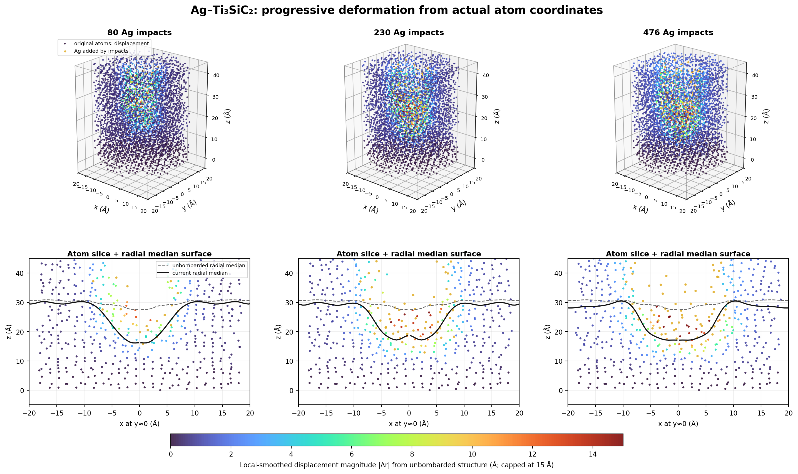

# 105–106 ps 延续轰击与熔坑几何审计

日期：2026-10-08。对象：Ag–Ti₃SiC₂ 小模型，已有 105 ps、471 次 Ag 轰击末态。本分支追加 5 次 62 eV Ag 轰击（第 472–476 发，间隔 0.2 ps），每发 0.2 ps、0.05 fs 步长；并从同一起始状态运行 1 ps 无轰击对照。每 5 fs 输出一帧。

## 结论

**已出现清楚的碗形几何熔坑候选。** 3D 高度图和穿过轰击中心的原子截面均可见约 20 Å 宽的中央凹陷，中心到外侧 8–12 Å 环带的平滑表面高度差约 12.9 Å。这个坑在 105 ps 起点就已存在；追加 1 ps 后深度约 12.5→12.9 Å，而无轰击对照约 12.4 Å，变化不到 1 Å，说明这 5 次新轰击没有带来可分辨的坑形增长。

坑形已经满足“明显几何凹坑”的观察目标，因此本轮在 106 ps 停止。此结论只针对形貌：不能由碗形表面本身推出 Ag 已形成稳定液态熔池。

图中 Ti、Si、C 都用同一种紫色表示 Ti₃SiC₂ 骨架，Ag 用金黄色表示；高度网格仍按 z 高度着色。原按元素区分颜色的版本保留在 `images/crater_3d_comparison_105_106ps.png`。

## 起始状态和运行检查

轰击支路的 `after_hit_471.data` 与无轰击对照起点 `after_control_start_105ps.data` SHA-256 完全相同：`2c1df3a0b5a2c537d001a140700bcb346a517ef01d608182834bfb1cb171d6af`。轰击支路从 4,776 个原子增加到 4,781 个（新增 5 个 Ag）；对照保持 4,776 个。两支路的 5 个 LAMMPS 日志均无 `ERROR:` 或丢原子信息。轨迹、力和分析数值均有限；日志里的字面 `INF` 只用于 LAMMPS 无限边界 `region ... block INF INF`，不是非有限计算结果。

轰击支路 5 fs 采样到的最大力为 101.4 eV/Å（第 475 发的入射 Ag，105.99 ps）；这是轰击碰撞期间的采样峰值，应作为高瞬时力记录。第 476 发末态 Ti₃SiC₂ 最大连通簇比例约 99.90%，Ag 约 96.58%；对照分别约 99.93% 和 96.47%。

## 熔坑几何

高度图按原子坐标重建周期表面，排除 `z ≥ 55 Å` 的真空飞散原子；为可视化采用高斯平滑。中心区定义为 `r < 2 Å`，比较环带为 `8 ≤ r < 12 Å`：

| 状态 | 中心平滑表面中位高度 | 外环中位高度 | 凹陷深度 |
|---|---:|---:|---:|
| 105 ps 轰击起点 | 18.20 Å | 30.66 Å | 12.47 Å |
| 106 ps 继续轰击 | 17.81 Å | 30.73 Å | 12.92 Å |
| 106 ps 无轰击对照 | 18.46 Å | 30.84 Å | 12.39 Å |

这些是表面几何高度，不是熔深或液层厚度。三维图中的自由表面、Ag（黄色）和 Ti₃SiC₂（紫色系）原子截面用于显示几何关系；平滑高度网格只为帮助看形状。

## 对照论文图显示形变区

这张图用未轰击的 4,305 原子结构作基准，按原子 ID 匹配后计算周期展开的位移，减去底部参考层的整体漂移。三维点和中心剖面显示的是**实际末态原子坐标**；原有原子的颜色表示局部平滑位移幅值 `|Δr|`，新加入的 Ag 用金色标出。黑线是实际表面的径向中位轮廓，灰虚线是未轰击表面。论文图的红黄蓝色标表示温度，而本图的色标表示位移，因此它能显示局部形变与坑形，不能代替温度场或熔化判据。

| 累计 Ag 轰击数 | 中心相对外环表面凹陷 | 中心区原子位移 P90 | 远场位移 P90 |
|---:|---:|---:|---:|
| 80 | 13.9 Å | 10.9 Å | 0.9 Å |
| 230 | 11.5 Å | 16.9 Å | 1.5 Å |
| 476 | 12.9 Å | 16.4 Å | 2.0 Å |

这说明模型确实出现了集中在轰击点附近的强形变区和碗形表面坑，形状概念上接近论文所展示的局部受影响区。但三列表示本模型的轰击次数，不是论文的 W70/W80/W90 工况；位移颜色也不是温度。它不能单独证明已经形成论文图对应的液态熔区。

## Ag 局部结构与迁移

同一组 223 个 105 ps 起点附近 Ag 示踪原子，漂移校正后 1 ps MSD 为轰击 19.79 Ų、无轰击 15.64 Ų；0.2–1.0 ps 线性拟合斜率分别为 21.32 和 16.81 Ų/ps。坑区瞬时局部 Ag 动能温度的逐帧中位数分别约 3,905 K 和 3,554 K，波动很大。

坑区平均局部 Q₆：轰击支路 0.3883→0.3869，对照 0.3883→0.3809；平均 3.5 Å 内配位数分别为 6.036→6.133 和 6.036→5.941。起点定义的 863 对 Ag–Ag 第一近邻，1 ps 后保留比例为轰击 63.6%、对照 64.0%。同一 Ag EAM 的纯 Ag 1800 K“液态样”参考约为 Q₆=0.400、1 ps 近邻保留 46.9%；300 K 固态参考约保留 100%。本模型坑区的迁移显著，但近邻持续性仍强于该纯 Ag 液态样参考，说明不能据此声称形成了完整连续液相。

## 解释边界和后续

- **原子未丢失**：两条 1 ps 轨迹的原子数检查通过。
- **几何熔坑**：碗形凹陷清楚可见，中心比外环低约 13 Å；该形貌在 105 ps 起点已经形成。
- **液态 Ag 熔池**：尚未验证。局部高温和高迁移支持“高温、强无序/迁移的 Ag 坑区”，但短时局部温度、Q₆、配位数和近邻保留都不是独立充分判据。
- Ag–Ti₃SiC₂ 交叉势尚未经过独立验证；纯 Ag EAM 参考不能验证交叉相互作用。因此此结果是探索性 MD 候选，不是已验证的真实真空电弧熔池。

同一参数下继续轰击 1 ps 并未使坑显著长大；因此本轮没有为追求图像而无限延长。若下一步目标是证明“液态熔池”，应先做与本势一致的局部结构/扩散判据和交叉势验证；若目标是扩大到更接近论文形貌的坑，则应基于已保存的 106 ps 检查点另行规划轰击能量、束斑与热沉，而不应把延长时间当作唯一调参手段。

## 文件

- 轰击形变区三时点对比：`images/deformation_history_80_230_476impacts.png`；数据摘要 `analysis_deformation_history.json`，绘图脚本 `render_deformation_history.py`
- 双色 3D 图：`images/crater_3d_two_phase_colors_106ps.png`
- 按元素分别着色的对照版：`images/crater_3d_comparison_105_106ps.png`
- 轰击轨迹局部指标：`analysis_summary.json`、`analysis_local_order.csv`、`analysis_msd.csv`、`analysis_local_temperature.csv`
- 近邻保留对比：`analysis_neighbor_survival_extension.json`、`analysis_neighbor_survival_extension.csv`
- 分段日志、结构、restart 和压缩 dump：本分支 `logs/`、`structures/`、`restart/`、`dumps/`
- 同起点无轰击对照：`../noimpact_control_1ps_after105ps_20261008/`
- 文件清单和 SHA-256：本分支 `SHA256SUMS.txt`
