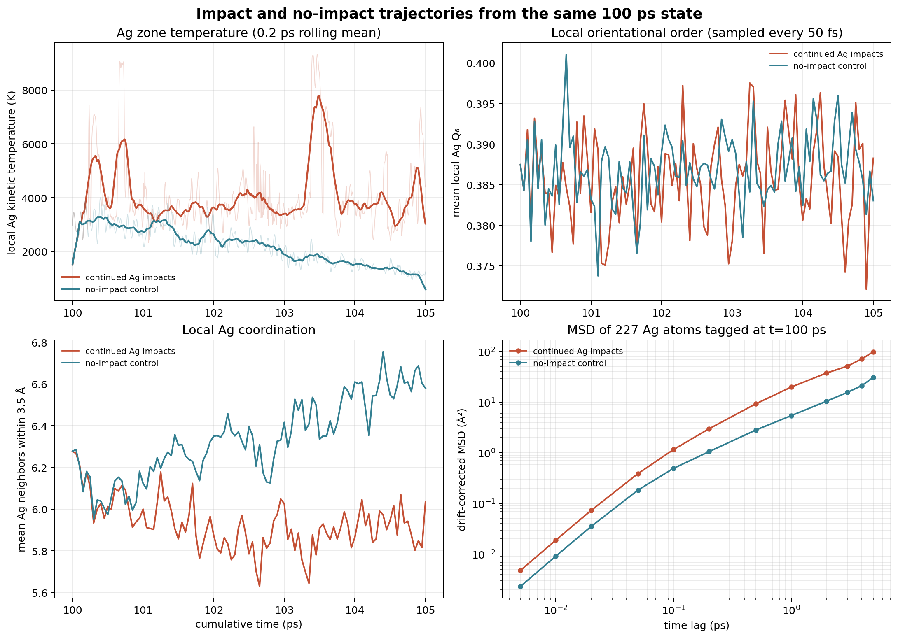

# 100 ps 末态的 Ag 液态特征诊断

日期：2026-10-08；对象：Ag–Ti₃SiC₂ 小模型的坑区，已有 100 ps 连续轰击末态。
目的：判断坑区 Ag 是否表现出持续液态迁移特征。此次没有重跑 100 ps 主模拟。

## 做了什么

从第 446 发结束的 100 ps 检查点建立两条互相独立的 5 ps 分支：

1. **继续轰击**：追加 25 个 62 eV Ag 入射（第 447–471 发），入射间隔 0.2 ps。
2. **匹配对照**：不再加入 Ag，使用同一初始坐标和速度、同一势、边界、热沉设置及相同的 25 个 0.2 ps 时间窗。

两条轨迹均按 5 fs 采样，共 1001 帧。分析跟踪初始坑区内同一组 227 个 Ag 原子，使用漂移校正 MSD；同时记录局部 Ag 温度、局部 Q₆、Ag 配位数、组分连通簇和全体系数值状态。图中的坑区取横向半径 `r < 8 Å`、`z=12–55 Å`；Q₆ 统计采用同一区域、3.6 Å 邻居范围并排除邻居数少于 5 的中心原子。局部温度来自有限原子群的瞬时动能，统计波动较大。

## 结果

| 指标 | 继续轰击 | 无轰击对照 |
|---|---:|---:|
| 1 ps 漂移校正 MSD | 19.96 Ų | 5.44 Ų |
| 5 ps 漂移校正 MSD | 99.55 Ų | 31.14 Ų |
| 0.2–1 ps MSD 线性拟合斜率 | 21.23 Ų/ps | 5.45 Ų/ps |
| 局部 Ag 动能温度：中位数（逐帧 P10–P90） | 3630 K（2957–6316 K） | 2216 K（1312–3195 K） |
| 平均局部 Q₆：起始 → 结束 | 0.3875 → 0.3883 | 0.3875 → 0.3830 |
| 平均 Ag 配位数（3.5 Å 内）：起始 → 结束 | 6.278 → 6.036 | 6.278 → 6.580 |
| 末态仍在初始坑区的示踪 Ag | 87.2% | 95.6% |

按 `斜率/6` 换算的数值为轰击约 3.54、对照约 0.91 Ų/ps，约相差 3.9 倍。但轰击过程是强非平衡的，这只是拟合得到的**表观迁移率量级**，不是平衡自扩散系数。

轰击支路中 43.6% 的示踪原子漂移校正位移超过 5 Å，25.1% 超过 10 Å；对照分别为 22.0% 和 8.4%。这表明持续轰击使局部 Ag 更热、迁移更快，也有更多 Ag 离开原坑区。与此同时，5 ps 内平均 Q₆ 没有进一步明显下降，配位数变化也不能独立区分液体与受冲击的强振动态。

图文件：[`images/impact_vs_control_5ps.png`](images/impact_vs_control_5ps.png)。细线是采样值，粗线为 0.2 ps 滚动均值。

## 数值与几何异常

高频帧扫描发现第 466 发中，累计时间 103.905 ps 时，Ag 原子 4508 与 4771 的距离为 **1.3265 Å**，两原子力模分别约 **151.54、150.85 eV/Å**。前一帧（103.900 ps）间距约 1.5000 Å，后一帧（103.910 ps）约 1.7851 Å，表现为短促近接后反弹。该峰被原先只检查每段末态的最大力门槛漏掉了。

该瞬时事件没有导致原子丢失、NaN/Inf 或 LAMMPS 错误；5 ps 轰击支路最终有 4776 个原子（起始 4751 个，增加 25 个入射 Ag）。末态 Ti₃SiC₂ 最大连通簇为 2905/2908（99.90%），Ag 最大连通簇为 1800/1868（96.36%）。无轰击对照原子数保持 4751。这个大力近接对局部相态解释构成实质限制，需先做时间步敏感性检查。

诊断运行器第一次检查第 447 发时曾把 LAMMPS 输入回显中的字面量 `INF` 误识别为数值非有限值；第 447 发计算本身已完整完成，检查规则改为大小写敏感后对现有输出继续审计，没有重算这一发。之后对 5 fs 轨迹重新扫描才发现上述段内力峰，因此报告不把“每段检查通过”解释成“所有中间帧都无异常”。

## 结论

- **可支持的判断**：坑区 Ag 在继续轰击时呈现更高的局部动能温度和约 3.9 倍的短时间表观迁移斜率；这与“冲击加热造成高迁移、强无序的 Ag 坑区”相符。Ti₃SiC₂ 主骨架仍保持高度连通。
- **当前不能据此确认的判断**：不能仅凭局部温度、位移、表面坑形或一张三维快照，确认形成了稳定、连续的液态 Ag 熔池。Q₆ 与配位数没有给出明确的持续相变信号，而且发现了一个极短 Ag–Ag 近接事件。
- **模型边界**：Ag 使用 EAM，Ti₃SiC₂ 使用 Tersoff，Ag–Ti/Si/C 使用 Morse 并叠加 ZBL；Ag–Ti₃SiC₂ 交叉相互作用尚未独立验证。因此这是探索性 MD 结果，不是材料熔化温度或真实电弧阴极熔池的定量预测。

## 如何把“可能熔池”推进到可检验的液相结论

1. 先在同一势函数下校验纯 Ag 固相、液相及熔化行为，并对 Ag–Ti₃SiC₂ 交叉相互作用做独立验证；否则相态判定的基础不稳。
2. 从 103.9 ps 异常之前的检查点做短程时间步收敛复核，比较当前 0.05 fs 与更小时间步下近接距离、峰值力、能量漂移和轨迹是否一致。未通过前，不用该事件附近数据证明熔化。
3. 对相同局部温度条件下的固态、液态参考，计算同一套局部径向分布函数、Q₆/配位分布和原子 MSD；检查这些指标是否在空间上形成连通区，并持续多个皮秒，而非只在冲击瞬间出现。
4. 若这些验证都支持液态，再将结果表述为“连续轰击下形成局部液态 Ag 熔池/坑区”，同时继续区分 Ag 熔化与 Ti₃SiC₂ 骨架是否保持固态。

目前最合适的表述是：**100 ps 轰击末态附近存在熔坑候选；追加轰击进一步增强了 Ag 的局部迁移和加热，但液态熔池尚未验证。**

## 数据与可复核文件

- 轰击支路的 25 个分段日志、restart、结构、压缩 dump、审计和分析文件均在本目录。
- 匹配无轰击对照在 [`../liquid_control_noimpact_5ps_20261008/`](../liquid_control_noimpact_5ps_20261008/)。
- 对照 JSON：[`comparison_impact_control.json`](comparison_impact_control.json)。
- 主要脚本：[`run_liquid_diagnostic.py`](run_liquid_diagnostic.py)、[`analyze_liquid_diagnostic.py`](analyze_liquid_diagnostic.py)、[`compare_impact_control.py`](compare_impact_control.py)。
- 两支路各自的 `SHA256SUMS.txt` 用于文件完整性复核。

## 第466发碰撞的后续时间步复核

后续从相同第465发初态，用同一入射位置/速度和热浴随机种子，将第466发时间步由0.05 fs减半到0.025 fs，仍运行0.2 ps。ID 4771是入射Ag，ID 4508是目标基体Ag。在两支路共同采样点103.905 ps，两原子距离和力几乎完全重合；细采样另发现103.9025 ps存在1.3168 Å的更近瞬间，说明原5 fs轨迹漏采到了碰撞峰值。此高力事件应解释为Ag入射原子与基体Ag的直接撞击，Ag–Ag势含ZBL短程项；减半时间步后事件仍复现，因此不是原步长单独造成的基体重叠。详细结果见 [`时间步复核报告`](../liquid_dt_sensitivity_hit466_halfstep_20261008/REPORT_dt_sensitivity_中文.md)。

这一发的减半步长复核只检验碰撞是否由积分步造成，并未系统地收敛最大瞬时力，也未验证Ag–Ti₃SiC₂交叉势或熔池相态。
