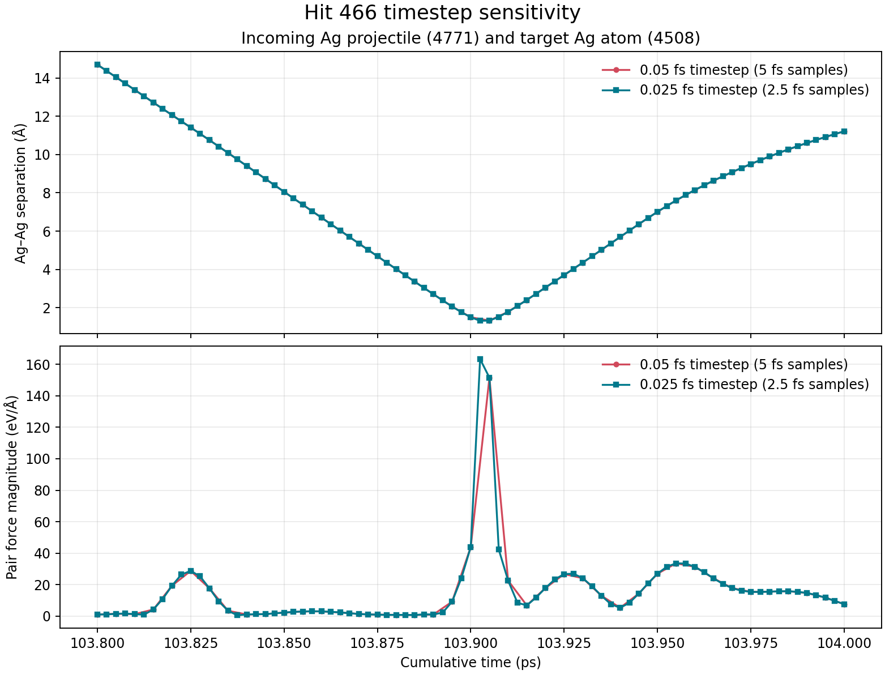

# 第466发入射碰撞的时间步敏感性复核

日期：2026-10-08；范围：100 ps后续轰击轨迹的第466发（累计约103.8–104.0 ps）。

## 设置

从同一第465发末态开始，将已完成的第466发输入单独复制到本复核分支。初态文件 SHA-256 为 `0de755108b45f7c53371a96e5774fbf546b0ec2beeffcfc0b357095dbe7f3e0e`，与原分支第465发结构完全一致。重复使用相同的Ag入射原子（ID 4771、62 eV、位置 `(6.6810405777, 20.9416452647, 60.0) Å`、`vz=-105.3164 Å/ps`）、同一热浴种子624166、同一势文件和边界。唯一的积分修改是：

| 分支 | 时间步 | 步数 | 物理时间 | dump间隔 |
|---|---:|---:|---:|---:|
| 原始 | 0.05 fs | 4000 | 0.2 ps | 5 fs |
| 复核 | 0.025 fs | 8000 | 0.2 ps | 2.5 fs |

比较入射 Ag（ID 4771）与目标基体 Ag（ID 4508）的距离及各自受力，同时检查 LAMMPS 数值状态、热浴功校正能量和末态连通簇。

## 观察

- 两组在共同采样时刻 **103.905 ps** 几乎完全一致：距离分别为1.32651465 Å和1.32651465 Å（差约0.0000015 Å）；目标原子力151.5415与151.5430 eV/Å，差约0.0015 eV/Å。
- 2.5 fs采样在更早的 **103.9025 ps** 记录到更近的瞬间：距离1.31683371 Å，目标和入射原子的力分别约163.34、162.59 eV/Å。原始5 fs输出没有采到这一帧，因此此前151.5 eV/Å不是碰撞过程的最高采样值。
- 距离随后回升：复核分支在103.905 ps为1.3265 Å、103.9075 ps为1.5195 Å。近接时间约几个飞秒，具有入射碰撞的时空特征。
- 热浴能量校正量 `Etot + f_bathfix` 在完整0.2 ps内的数值范围：0.05 fs分支0.00734 eV，0.025 fs分支0.00508 eV；起点到终点分别漂移−0.00187 eV、−0.00264 eV。
- 复核分支全程4771个原子，未发现丢原子、NaN/Inf或LAMMPS错误。末态 Ti₃SiC₂ 最大连通簇2905/2908（99.90%），Ag最大连通簇1793/1863（96.24%）。

## 解释

这次高力来自ID 4771入射Ag与ID 4508基体Ag在62 eV轰击中的直接碰撞。模型对Ag–Ag同时启用EAM和ZBL短程项，所以强短程排斥与这次入射相符。碰撞在减半时间步后仍复现，说明它不是由0.05 fs积分步单独制造的基体原子重叠。

更密的轨迹发现比5 fs采样更近的瞬时接触，所以**碰撞事件可靠，瞬时最小距离和最大力仍受采样间隔影响**。本次只做0.05与0.025 fs两档、一发事件，不称为完整的积分收敛证明；也不改变Ag–Ti/Si/C交叉势尚未验证的状态。

这项检查消除了“碰撞是否由原积分步造成”的主要疑问，但不单独证明局部Ag已熔化。液态判定仍需在同一势下的固/液参考、局部RDF与序参量，并确认可持续的空间连通液态区域。

## 文件

- 可复算脚本：[`analysis/analyze_dt_sensitivity.py`](analysis/analyze_dt_sensitivity.py)
- 机器可读汇总：[`analysis/dt_sensitivity_summary.json`](analysis/dt_sensitivity_summary.json)
- 逐帧配对距离和力：[`analysis/pair_force_timeseries.csv`](analysis/pair_force_timeseries.csv)
- 计算日志、压缩前轨迹、起始/末态、restart及势文件均与本报告同目录。
- `SHA256SUMS.txt` 覆盖本分支各文件，用于完整性核对。
