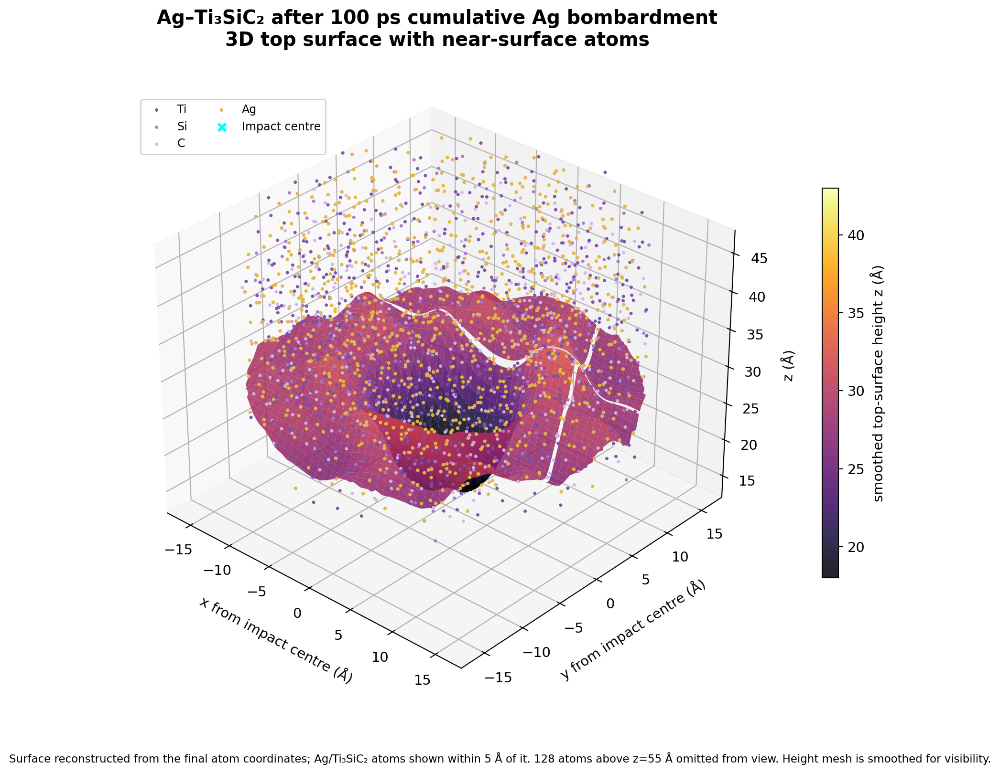

# Ag–Ti₃SiC₂ 小模型连续 Ag 轰击：累计 100 ps

## 结果概览

已从保存的第 339 发状态继续至第 446 发。累计轰击积分时间为 **100.0 ps**，共 446 个 62 eV Ag 入射事件。末态有 **4,751 个原子**：Ti 1,464、Si 519、C 925、Ag 1,843。成功轨迹的原子数按每次入射递增，没有发生 Lost atoms。

末态表面可见一个碗状凹陷，适合称为**探索性熔坑形貌候选**。这次从第 339 发延长到 100 ps 的过程中没有新出现一个此前不存在的坑：同一表面高度审计显示，凹陷在续算起点附近（第 55 发、约 21.8 ps）已经很明显；后续至 100 ps，中心相对 8–12 Å 环带的深度只增加约 0.84 Å。因此不能把坑的形成单独归因于这段续算。

图中金色为 Ag，紫色系为 Ti、Si、C；表面高度网格经过平滑以便看出整体坑形。高于 z=55 Å 的 128 个飞行/溅射原子只在图中隐藏，没有从末态结构删除。

## 运行设置与累计时间

- 使用 LAMMPS 官方静态 Linux x86_64 二进制（30Sep2026）；每个轰击段 4,000 步，时间步长 0.00005 ps，即 0.2 ps/发。Ag 入射能量为 62 eV，底部 300 K 热沉保持启用。
- 第 1–36 发按 0.5 ps/发；第 37–446 发按 0.2 ps/发：`36×0.5 + 410×0.2 = 100.0 ps`。这是轰击段的累计积分时间，不含检查点间的额外停顿。
- 本次从第 339 发的保存状态继续，完成第 340–446 发（另增加 21.4 ps）。完整可复查状态从第 55 发后的 `structures/start_after55.data` 开始保存。
- 最终盒子面内矢量约为 `a=(37.286,0,0) Å`、`b=(-18.643,32.291,0) Å`，z 边界约为 -10 至 102.6 Å。初始固体主要位于 z≈0–50 Å；非周期 z 边界在续算中采用可扩展的 `m` 设置以保留飞出原子的记录。x/y 面内周期。

## 坑形审计

表面高度按 72×72 面内分箱，从 z=18–55 Å 原子中取每格最高原子，经周期高斯平滑后计算径向中位数。中心取轰击中心 r<2 Å，环带取 r=8–12 Å：

| 状态 | 中心表面高度 | 8–12 Å 环带高度 | 中心相对环带凹陷 |
|---|---:|---:|---:|
| 无轰击初始结构 | 33.75 Å | 37.47 Å | 3.71 Å |
| 第 55 发后（约 21.8 ps） | 24.61 Å | 36.45 Å | 11.84 Å |
| 第 446 发后（100 ps） | 24.34 Å | 37.02 Å | 12.68 Å |

这是平滑表面网格的形貌统计，不是液相判据。12–18 Å 环带的末态相对中心凹陷为约 11.59 Å；模型没有形成非常突出的连续高 rim。

## 末态审计

- 最大连通簇：Ti₃SiC₂ 为 2,906/2,908（99.93%，距离截断 3.1 Å）；Ag 为 1,770/1,843（96.04%，3.35 Å）。仅计初始结构中的 Ag 原子 ID≤4305 时，最大簇为 1,371/1,397（98.14%）。这说明两相的大部分原子仍属于各自的连通簇，不等价于证明骨架无损或 Ag 已熔化。
- 第 446 发末段（0.2 ps）局部动能温度估算：轰击中心 8 Å 内 Ag 2,955 K（44 个原子），Ti₃SiC₂ 2,792 K（155 个原子）；最大力 45.37 eV/Å。有限原子群的瞬时动能温度不能单独证明液相。
- 最近邻审计：Ag–Ag 1.679 Å；Ag–Ti₃SiC₂ 1.726 Å；C–C 1.346 Å。末态有 20 对 C–C 距离小于 1.5 Å；短 C–C 接触也出现在前置结构审计中，仍是重要几何问题。
- Ag–Ti₃SiC₂ 交叉势未经过独立验证；模型采用的经典势和局部温度不足以确认“银已熔化、骨架保持固态”。目前可报告的是坑状形貌、局部高动能/迁移响应与连通簇统计，**不能据此宣称已验证真实熔池或实验尺度阴极熔坑**。

## 续算中的异常与修正记录

1. 第 323 发首次尝试因新 Ag 与已有 Ag 初始间距只有 0.489 Å，在 0.07 ps 报 Lost atoms。该失败尝试没有计入累计时间；第 322 发的完整状态已保存，并从那里重做第 323 发。修正后的轰击位置与已有原子三维距离至少 2.5 Å，并从该发起令 z 边界可扩展。失败现场及对应输入、日志、dump 保存在 `failed_attempts/hit323_fixed_boundary_and_overlap/`。
2. 审计发现旧驱动在第 56–322 发的每个 25 发批次重置了同一随机序列，导致发射位置出现重复周期。第 323 发起改为连续全局随机序列并记录重采样后的实际位置。该采样历史不均一，后续比较不同批次时必须考虑这一点。
3. 第 435 发完成 0.2 ps，但末帧最大力达到 123.661 eV/Å，来自凝聚相内一对 Ag（间距 1.347 Å），超过常规审计上限，因此单独归档，没有记作常规通过。按预定只追加一段检查后，第 436 发最大力回到 43.22 eV/Å、最近 Ag–Ag 距离为 1.900 Å；后续至第 446 发没有 Lost atoms 或 LAMMPS 数值错误。第 435 发完整事件资料在 `checkpoints/force_event_after_hit_435/`。

## 文件

- 最终原子结构：`checkpoints/after_hit_446.data`（SHA-256 `2f589012a09e4facb695d001b3773aa60e12652f66a6b559a641b6ee82851d77`）
- 无轰击基线副本：`structures/pristine_base_4305.data`（SHA-256 `c707a61841ca35f373c0642712ef3eb20d9c325790b61cdef031ae5bb21953e9`；仅用于形貌对照）
- 最终 restart、dump：`checkpoints/after_hit_446.restart`、`checkpoints/after_hit_446.dump`
- 当前续算态：`restart/state_current.restart` 与 `structures/impact_446_62eV.data`
- 每发进度与逐发审计：`run_progress.csv`、`audit/`
- 运行输入、日志和中间检查点：`inputs/`、`logs/`、`checkpoints/`
- 图像脚本：`audit/render_3d_final.py`
- 文件校验清单：`SHA256SUMS_final.txt`
