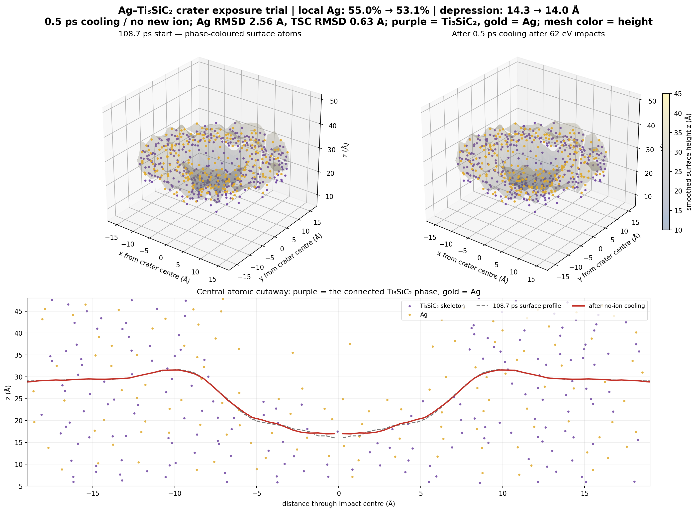

# Ag–Ti₃SiC₂ 轰击坑候选模型

## 本轮做了什么

从累计到第 482 发的结构出发，参考论文中的 62 eV 入射能量和 200 fs 间隔，对 Ag–Ti₃SiC₂ 小模型又做了 5 发 Ag 离子轰击（编号 483–487）。论文给出的 62 eV 条件不是针对 Ag；这里把入射粒子换成 Ag，并按 Ag 原子质量换算速度。每发跟踪 0.2 ps，步长 0.025 fs。之后不再加新离子，在相同势和热沉设置下继续 0.5 ps。

## 结果

- 最终模型有 4,792 个原子；轰击和冷却段都没有原子数异常或 LAMMPS 错误。
- 坑形为碗状凹陷。相对撞击前状态，坑深由约 14.3 Å 变为冷却后的约 14.0 Å。
- 坑中心 r<4 Å、10≤z<35 Å 区域的 Ag 原子数占比由 55.0% 变为 53.1%。它仍含有较多 Ag，**还没有实现坑内只剩 Ti₃SiC₂ 骨架**。
- z>50 Å 真空统计区里的 Ag 数由 213 增到 220，冷却后为 222；这些原子仍保留在模拟盒中，不能把它们等同于已离开体系的原子。
- 冷却段中，初始坑区 Ag 原子的均方根位移为 2.56 Å，Ti₃SiC₂ 原子为 0.63 Å。Ag 比骨架更活跃，但这段 0.5 ps 的非平衡位移不足以单独证明液态。
- Ti₃SiC₂ 最大连通簇为 2,905/2,908 个原子（99.90%）；冷却后仍连通。

## 结论边界

目前得到的是**可见的轰击坑样碗形凹陷和仍连通的 Ti₃SiC₂ 骨架**。这组结果没有形成“坑内只剩骨架”，也不能据此确认真实熔池。Ag–Ti、Ag–Si、Ag–C 交叉相互作用仍是探索性势，尚未验证；局部动能温度或短时位移都不能单独作为液态判据。

另做的 150 eV 敏感性测试没有得到持续露骨架趋势；500 eV 是论文里的高能单离子对照条件，不是电弧主条件，且带来很强的瞬态升温，因此没有继续加打。各测试的图片和指标在 `sensitivity/`。

## 文件

- `images/AgTi3SiC2_crater_after_62eV_cooling_3D.png`：紫色为 Ti₃SiC₂，金色为 Ag，网格表示表面高度。
- `structures/model_after_0p5ps_cooling.data`：最终结构，可作为 LAMMPS data 文件载入 OVITO。
- `structures/model_after_487th_62eV_impact.data`：冷却前结构。
- `restart/restart_after_0p5ps_cooling.restart`：最终结构对应的 LAMMPS restart。
- `inputs/`、`logs/`、`trajectory/`：输入、日志和压缩轨迹；`structures/intermediate/`、`restart/intermediate/` 保存第 483–486 发的阶段结果。
- `potentials/`、`audit/`、`scripts/`：势文件、几何与连通审计、短时位移分析脚本及几何、连通审计脚本。

原子类型：1=Ti，2=Si，3=C，4=Ag。全部交付文件的 SHA-256 位于 `SHA256SUMS.txt`。
