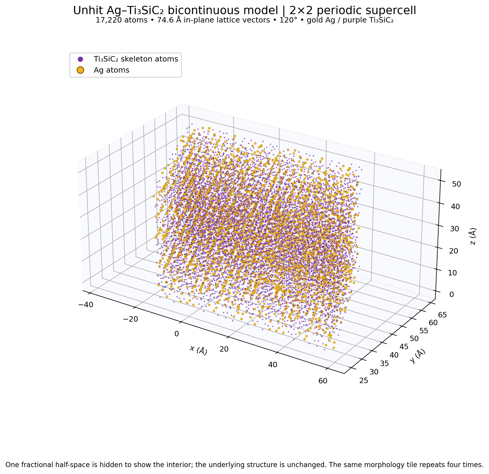
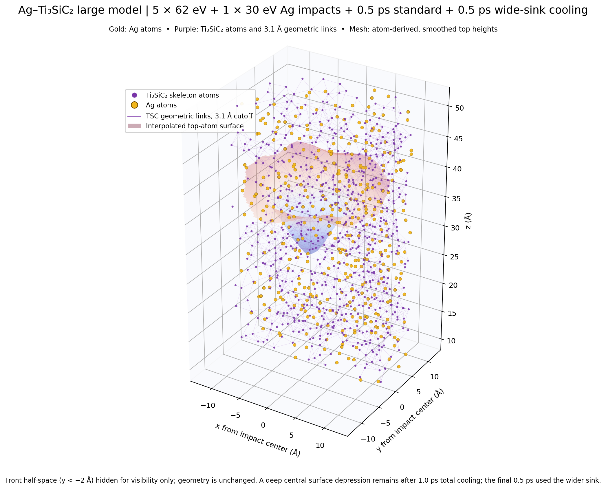
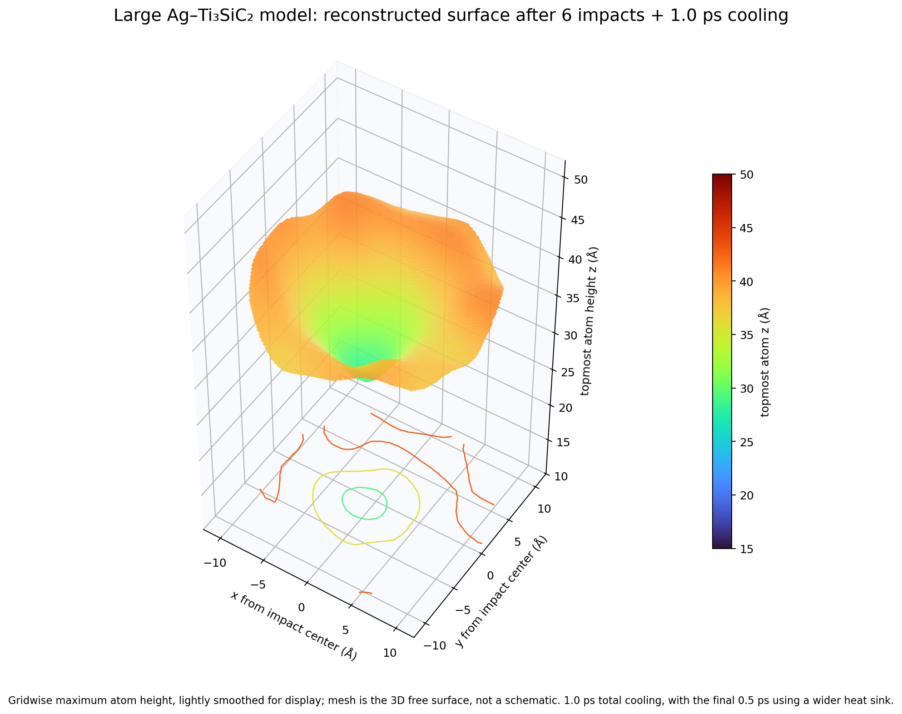

# Ag–Ti₃SiC₂ 大模型轰击坑候选（2026-10-07）

## 结果

已把约 4,305 原子试件横向重复为 2×2 周期超胞，得到 17,220 原子大模型；随后做了 6 次 Ag 入射（5×62 eV、1×30 eV）。最佳观察态是第 6 发后先按原热沉冷却 0.5 ps，再按扩宽热沉冷却 0.5 ps 的快照，共 17,226 个原子。7 发检查分支另存作对照；本报告选第 6 发态，是因为它的 Ag/TSC 温差更有利。

该 3D 表面图显示一个碗状中心凹陷，来自原子最高表面位置重建，不是示意图。未轰击结构中心半径 0–2 Å 网格的最高原子高度中位数为 43.89 Å；六发冷却态降到 19.52 Å。周围 8–12 Å 环带从 42.10 Å 变为 42.95 Å。按这组网格定义，中心相对环带的下陷约 23.4 Å。中心网格数为 9，范围较小；原始轮廓数据见 `audit/surface_top_height_radial_profile.csv`。

## 模型与检查

- 横向超胞：两条基矢长度各约 74.572 Å，夹角 120°；原始 37.286 Å 形貌单元重复 2×2。它是尺度放大试件，不是新的独立随机形貌。
- 固体原子区约 0–51 Å；盒子 z 为 −10–100 Å（法向盒长 110 Å，顶部真空约 49 Å）。
- 未轰击原子数 17,220：Ti 5,856、Si 2,076、C 3,700、Ag 5,588。第 6 发后 Ag 入射原子并入，快照共 17,226 个原子；没有丢原子或 LAMMPS 数值错误。
- 第 6 发后宽热沉冷却态，r<8 Å、z=12–55 Å 内 Ag 动能温度约 3,047 K（155 原子），TSC 约 2,276 K（342 原子）。局部 Ag 原子相对未轰击态 RMS 位移 3.34 Å，47.4% 超过 2 Å；TSC RMS 位移 2.56 Å，30.4% 超过 2 Å。Ag 迁移更大，但 TSC 也有明显扰动。
- TSC 几何连通判据为 3.1 Å：11,632/11,632 在同一连通簇。Ag 判据为 3.35 Å：5,588/5,594 在最大簇（99.89%，4 个小簇）。这证明网络几何连通，不证明晶格仍有序或保持固态。
- 最短 Ag–TSC 距离 1.814 Å；未见小于 1.5 Å 的异相对。势系数文件为项目 Stage69 版本。

## 结论边界

这是一个**大模型碗状熔坑形貌候选**，并观察到 Ag 温度与迁移率高于 TSC 的阶段。它还不能证明形成了经验证的液态 Ag 熔池或保持了晶态 Ti₃SiC₂ 骨架：Ag–TSC 交叉势未经验证；本轮用温度、位移和几何连通作探索性指标，尚未计算可靠的结构序参量；局部小区域的温度统计波动较大。第 7 发后的冷却态仍保留凹陷，但 Ag/TSC 局部温差缩小，因此第 6 发态作为当前较合适的展示候选。

## 文件

- OVITO 可直接打开 `structures/after_hit6_total_1ps_cool_17226.data`。
- `dumps/after6_final_wide_sink_cooling.dump` 是最终 0.5 ps 宽热沉冷却段的轨迹。
- `inputs/`、`potentials/`、`audit/` 保存本段输入、势文件和审计结果。
- 3D cutaway 为了显示内部，隐藏了前半空间 y < −2 Å；数据结构未被裁剪。
